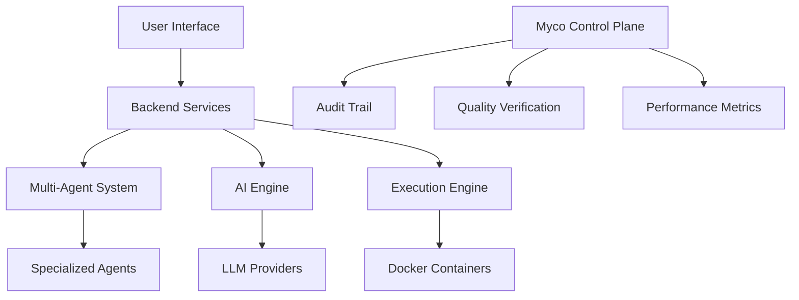

# 🚀 Myco Platform - Hybrid Development Platform

[](https://opensource.org/licenses/MIT)
[](https://www.docker.com/)
[](https://kubernetes.io/)
[](https://openai.com/)

**The only development platform that guarantees 100% complete project implementations through AI multi-agent verification.**

## 🌟 What Makes Myco Different

Unlike traditional development platforms like Replit or CodeSandbox, Myco Platform uses a sophisticated multi-agent AI system to ensure **every project is fully implemented, tested, and deployment-ready**. No more incomplete features or half-built applications.

### ✨ Key Features

- 🤖 **Multi-Agent AI System** - Specialized agents for planning, architecture, development, testing, and deployment
- 📊 **Complete Transparency** - Every AI decision is logged and auditable through the Myco control plane
- 🔒 **Sandboxed Execution** - Secure Docker-based code execution with resource limits
- 🎯 **100% Completion Guarantee** - Quality verification ensures all requirements are implemented
- 🌐 **Multi-Cloud Deployment** - Automated deployment to AWS, GCP, Azure, and more
- 🔄 **Real-Time Collaboration** - Live coding with team members
- 📱 **Modern Tech Stack** - React, TypeScript, Node.js, Python, Docker, Kubernetes

## 🏗️ Architecture Overview



### 🤖 Agent System

- **OrchestratorAgent** - Coordinates overall project execution
- **PlannerAgent** - Requirements analysis and project planning
- **ArchitectureAgent** - System design and technical architecture
- **BackendAgent** - API development and server-side logic
- **FrontendAgent** - UI/UX implementation and client-side code
- **InfrastructureAgent** - DevOps automation and deployment
- **SecurityAgent** - Security hardening and compliance
- **VerifierAgent** - Quality assurance and completeness verification

## 🚀 Quick Start

### Prerequisites

- Node.js 18+
- Python 3.11+
- Docker & Docker Compose
- Git

### Option 1: Automated Setup (Recommended)

```bash
# Clone the repository
git clone https://github.com/myco-platform/myco-platform.git
cd myco-platform

# Run automated setup
npm run setup
```

The setup script will:
- Install all system dependencies
- Set up databases (PostgreSQL, MongoDB, Redis)
- Install project dependencies
- Create environment files
- Verify the installation

### Option 2: Manual Setup

```bash
# Install dependencies
npm run install:all

# Set up environment files
cp backend/.env.example backend/.env
cp frontend/.env.example frontend/.env
cp ai-engine/.env.example ai-engine/.env

# Start databases
docker-compose up postgres mongodb redis -d

# Start all services
npm run dev
```

### Option 3: Docker Compose

```bash
# Start entire platform
docker-compose up -d

# View logs
docker-compose logs -f
```

## 🌐 Access Points

Once running, access the platform at:

- **Frontend**: http://localhost:5173
- **Backend API**: http://localhost:3000
- **AI Engine**: http://localhost:8000
- **Documentation**: http://localhost:3000/docs

## 📖 Project Structure

```
myco-platform/
├── .myco/                    # Control plane & audit trails
├── agents/                   # Multi-agent AI system
│   ├── orchestrator/         # Master coordinator
│   ├── planner/             # Requirements & planning
│   ├── architecture/        # System design
│   ├── backend/             # Backend development
│   ├── frontend/            # Frontend development
│   └── ...
├── ai-engine/               # Python AI engine (FastAPI)
├── backend/                 # Node.js backend (Encore.ts)
├── frontend/                # React frontend (TypeScript)
├── execution-engine/        # Docker execution environment
├── template-engine/         # Project scaffolding
├── deployment-engine/       # Multi-cloud deployment
├── infrastructure/          # IaC (Terraform, K8s)
├── monitoring/              # Observability stack
├── security/                # Security policies
└── scripts/                 # Automation scripts
```

## 🔧 Development Workflow

### Creating a New Project

1. **Open Myco Platform** in your browser
2. **Click "New Project"** and select a template
3. **Describe your requirements** in natural language
4. **Watch the AI agents work** - each agent contributes their expertise
5. **Review the implementation** - complete, tested, and documented
6. **Deploy with one click** to your preferred cloud provider

### Agent Orchestration

The Myco system coordinates multiple specialized agents:

```typescript
// Example: How agents collaborate
const projectRequest = {
  requirements: "Build a todo app with user authentication",
  techStack: ["React", "Node.js", "PostgreSQL"],
  deployment: "AWS"
};

// Orchestrator coordinates the agents
await orchestrator.executeProject(projectRequest);
// → PlannerAgent analyzes requirements
// → ArchitectureAgent designs the system
// → BackendAgent implements APIs
// → FrontendAgent builds the UI
// → SecurityAgent hardens the application
// → VerifierAgent ensures completeness
// → DeployerAgent deploys to AWS
```

### Quality Verification

Every project goes through rigorous verification:

- ✅ **Completeness Check** - All requirements implemented
- ✅ **Code Quality** - Meets industry standards
- ✅ **Security Scan** - No vulnerabilities
- ✅ **Performance Test** - Meets performance targets
- ✅ **Documentation** - Complete and accurate
- ✅ **Deployment Ready** - Fully configured for production

## 🚀 Deployment

### Development Environment

```bash
# Start all services locally
npm run dev

# Or with Docker
docker-compose up
```

### Production Deployment

```bash
# Deploy to cloud (AWS, GCP, Azure)
npm run deploy

# Deploy to Kubernetes
npm run k8s:deploy

# Deploy with Terraform
npm run terraform:apply
```

### Supported Platforms

- **AWS** - EKS, ECS, Lambda, RDS, S3
- **Google Cloud** - GKE, Cloud Run, Cloud SQL
- **Azure** - AKS, Container Instances, SQL Database
- **DigitalOcean** - App Platform, Kubernetes
- **Local** - Docker Compose, Kubernetes

## 📊 Monitoring & Observability

Myco includes comprehensive monitoring:

- **Metrics** - Prometheus + Grafana
- **Logging** - ELK Stack (Elasticsearch, Logstash, Kibana)
- **Tracing** - Distributed tracing for requests
- **Alerts** - Real-time notifications for issues
- **Dashboards** - Pre-built monitoring dashboards

## 🔐 Security

Security is built into every layer:

- **Container Security** - Sandboxed execution, resource limits
- **Network Security** - VPC isolation, security groups
- **Application Security** - Authentication, authorization, input validation
- **Data Security** - Encryption at rest and in transit
- **Compliance** - SOC2, GDPR, HIPAA ready

## 🧪 Testing

Comprehensive testing strategy:

```bash
# Run all tests
npm test

# Backend tests
npm run test:backend

# Frontend tests  
npm run test:frontend

# AI engine tests
npm run test:ai-engine

# Integration tests
npm run test:integration

# End-to-end tests
npm run test:e2e
```

## 📚 Documentation

- [Architecture Guide](docs/ARCHITECTURE.md)
- [API Documentation](docs/API.md)
- [Deployment Guide](docs/DEPLOYMENT.md)
- [Contributing Guide](docs/CONTRIBUTING.md)
- [Security Guide](docs/SECURITY.md)
- [Troubleshooting](docs/TROUBLESHOOTING.md)

## 🤝 Contributing

We welcome contributions! Please see our [Contributing Guide](CONTRIBUTING.md) for details.

### Development Setup

```bash
# Fork and clone the repository
git clone https://github.com/yourusername/myco-platform.git

# Create a feature branch
git checkout -b feature/amazing-feature

# Make your changes and commit
git commit -m "Add amazing feature"

# Push and create a pull request
git push origin feature/amazing-feature
```

## 📈 Roadmap

### Phase 1: MVP ✅
- Core agent system
- Basic project generation
- Docker execution
- Simple deployment

### Phase 2: Enhancement 🔄
- Advanced AI capabilities
- Real-time collaboration
- Multiple LLM providers
- Enhanced security

### Phase 3: Enterprise 📋
- Enterprise SSO
- Private cloud deployment
- Advanced analytics
- Compliance certifications

### Phase 4: Scale 🚀
- Global CDN
- Multi-region deployment
- Marketplace
- Advanced optimization

## 🆘 Support

- **Documentation**: https://docs.myco.dev
- **Community Forum**: https://community.myco.dev
- **Discord**: https://discord.gg/myco
- **Issues**: https://github.com/myco-platform/myco-platform/issues
- **Email**: support@myco.dev

## 📄 License

This project is licensed under the MIT License - see the [LICENSE](LICENSE) file for details.

## 🙏 Acknowledgments

- OpenAI, Anthropic, and Google for AI model APIs
- The open-source community for amazing tools and libraries
- Our contributors and early adopters

---

**Built with ❤️ by the Myco Platform Team**

Ready to build something amazing? [Get started now!](https://myco.dev/signup)